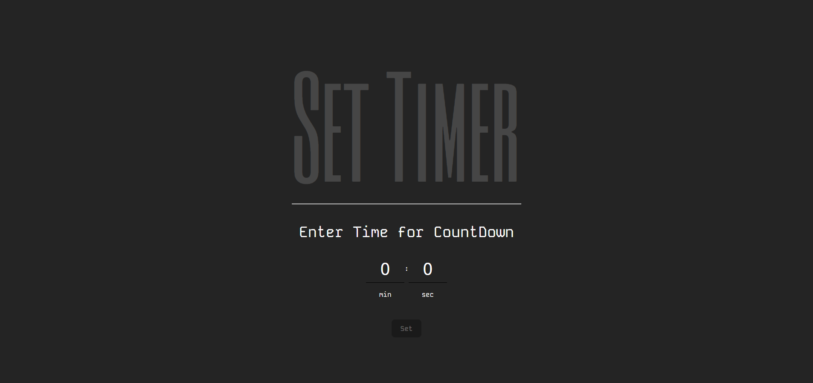
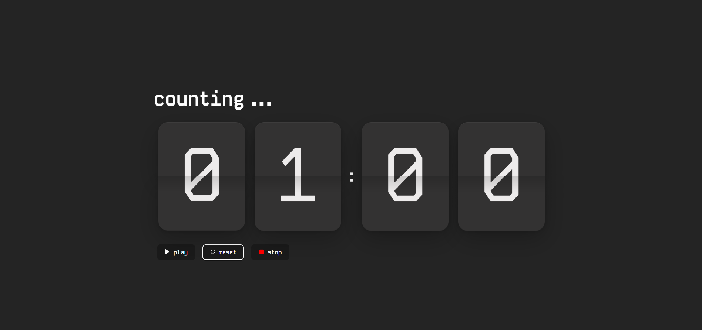

# Flip Timer

Flip Timer is a simple and interactive countdown timer application built using React. It allows users to set a timer with minutes and seconds, start, pause, reset, and stop the timer with a visually appealing flip animation.

## Features

- Set timer with minutes and seconds.
- Start, pause, and reset the timer.
- Stop the timer at any time.
- Flip animation for the countdown.

## Demo

## Usage

To use the Flip Timer, follow these steps:

1. Open your browser and navigate to `https://flip-timer-gamma.vercel.app/`.
2. Set the desired time for the countdown using the input fields for minutes and seconds.
3. Click the `Set` button to start the countdown.
4. Use the `pause` button to pause the timer and the `resume` button to resume it.
5. Click the `reset` button to reset the timer to the initial set time.
6. Use the `stop` button to stop the timer.

## Dependencies

The project uses the following dependencies:

- [`@pqina/flip`](https://www.npmjs.com/package/@pqina/flip) - A library for creating flip animations.
- [`react`](https://www.npmjs.com/package/react) - A JavaScript library for building user interfaces.
- [`react-dom`](https://www.npmjs.com/package/react-dom) - Serves as the entry point to the DOM and server renderers for React.
- [`react-icons`](https://www.npmjs.com/package/react-icons) - A library for including popular icons in React projects.

## Folder Structure

flip-timer/
- ├── public/
- │ ├── index.html
- │ └── ...
- ├── src/
- │ ├── components/
- │ │ ├── countdown/
- │ │ │ ├── index.js
- │ │ │ ├── index.css
- │ │ ├── flip/
- │ │ │ ├── index.js
- │ │ │ ├── index.css
- │ ├── App.js
- │ ├── index.js
- │ ├── index.css
- ├── package.json
- └── README.md
